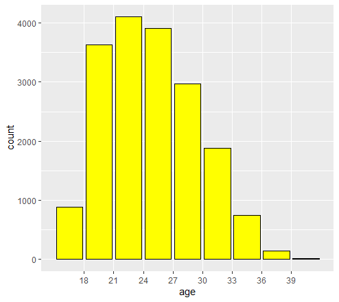
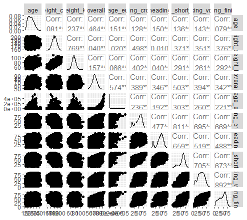
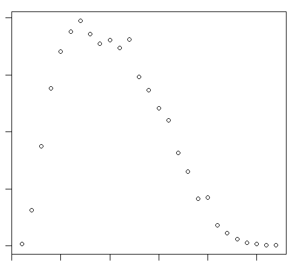
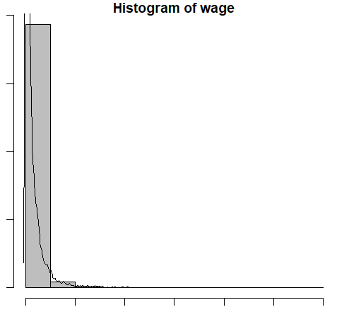
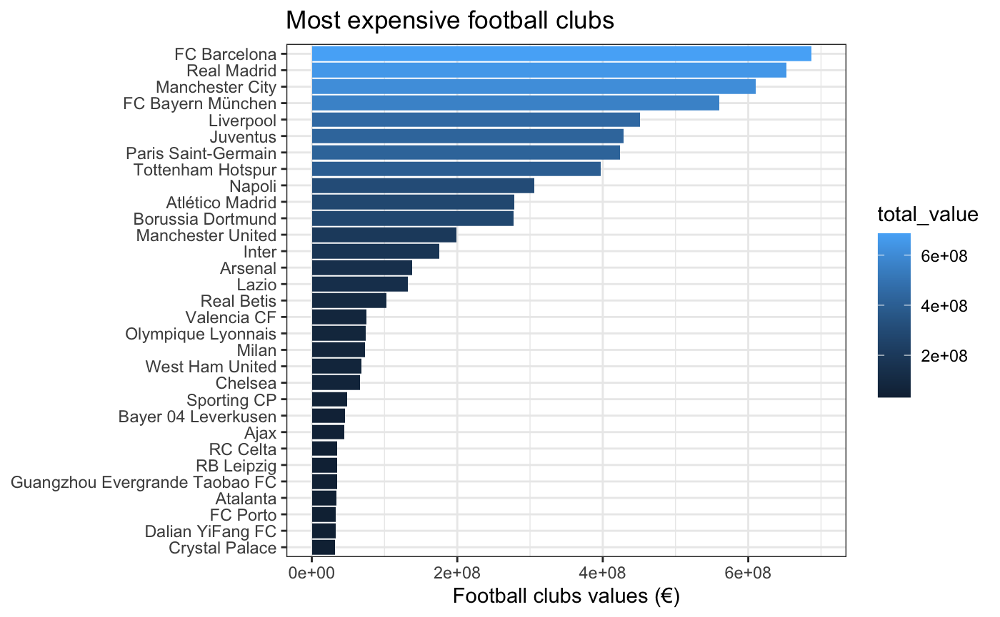
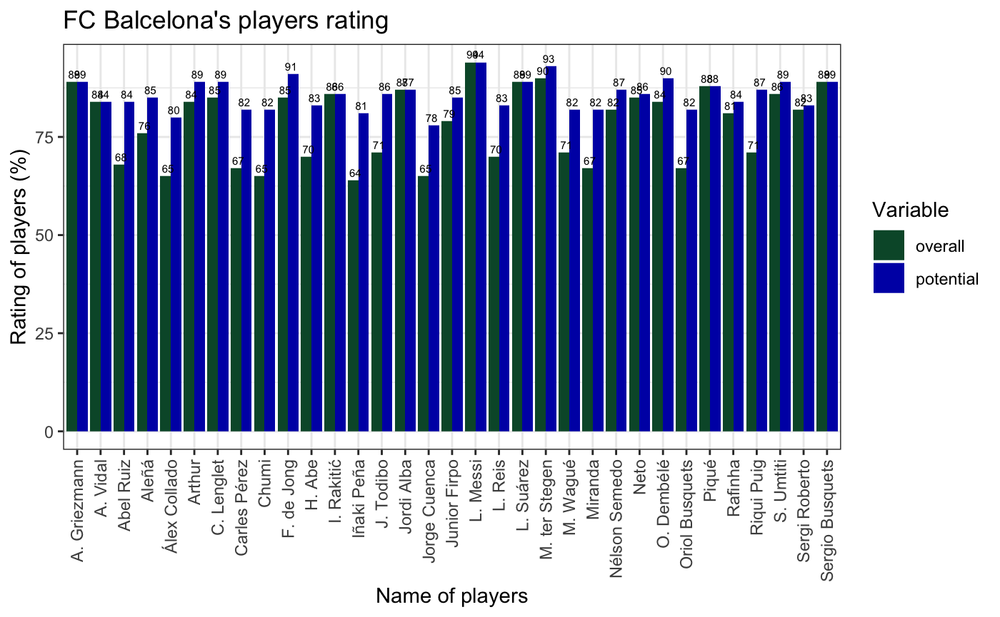
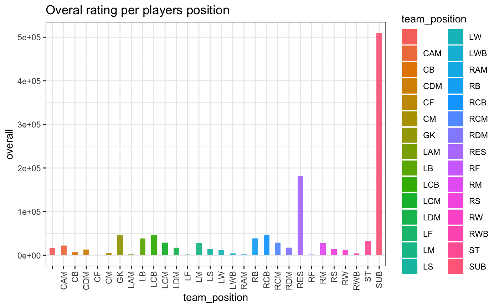
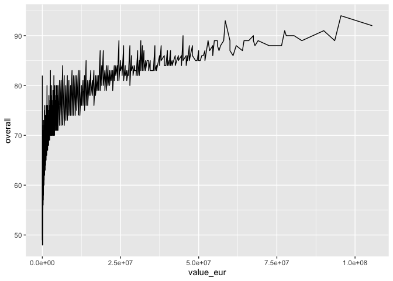
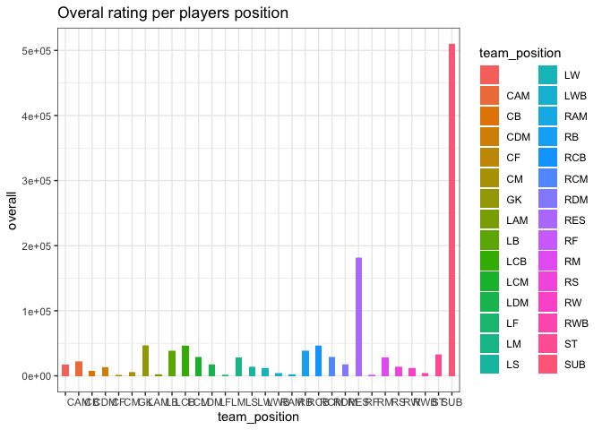
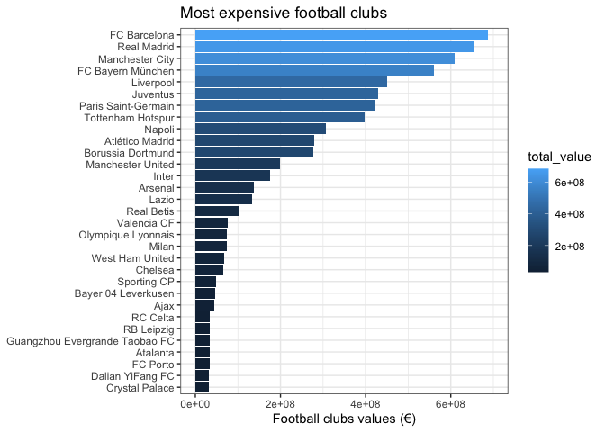

Stat 850 Project Description
================
<<<<<<< HEAD
Agyemang, Frank, Kusi

## Instructions

Each member of your team should modify this document in some way and
push their modifications to the repository in a separate commit. This
will ensure that you have set your repository up in a way that ensures
all group members are working with the same repository.

Note that you must compile your readme (this document) for it to
properly display as part of your github repository.

Once you have received feedback on your project proposal (via Canvas)
you may alter this README so that it describes your final project
instead of the project proposal.

## Data Set

Provide a link to your dataset here, and a description of the variables
in the data set.

<https://www.kaggle.com/datasets/thedevastator/fifa-world-cup-anomaly-detection-in-player-ratin?select=players_20.csv>

Football Data: This data was obtained from <https://kaggle.com>. It is a
website that grants free access to data on vast topics. The data
comprises of several variables that can be used for interesting analysis
in FIFA World Cup. The Fifa World Cup is the biggest stage in
international football, and the players that take part in it are some of
the best in the world. But what goes into making a great World Cup
player? Is it the wage of a player? Is it their individual ratings for
specific skillsets? Or something unrelated to the variables considered
in this dataset?

This dataset contains information on players overall ratings, as well as
their individual ratings for specific skillsets. This data can be used
to probe into so many aspects related to the World Cup and its players,
including anomaly detection for player ratings.

## Potential Topics to Explore Using the Data Set

Describe avenues you might explore using the data 1. Anomaly detection
for player ratings: This is where we try to determine an association
between the overall rating of a player (s) and all other quantitative
variables. This will be done in a pair-wise manner.

2.  We will look at the distribution of each of the variables to
    determine whether it satisfies the normality assumption and then
    make plots that shows the spread of each quantitative variable from
    its mean.

3.  We also consider the overall player rating and regress it on some
    variables of interest.

## Group Members

List all of the project contributors here. John Mensah Frank Agyemang
Christian Uwineza

## Dr. Vanderplas’ Exploration of the Data

Ideally, this would have been something you provided as part of your
data explanations :).

### Weather Data

       sofifa_id       player_url         short_name         long_name        
     Min.   :   768   Length:18278       Length:18278       Length:18278      
     1st Qu.:204446   Class :character   Class :character   Class :character  
     Median :226165   Mode  :character   Mode  :character   Mode  :character  
     Mean   :219739                                                           
     3rd Qu.:240796                                                           
     Max.   :252905                                                           
                                                                              
          age           dob              height_cm     weight_kg    
     Min.   :16.0   Length:18278       Min.   :156   Min.   : 50.0  
     1st Qu.:22.0   Class :character   1st Qu.:177   1st Qu.: 70.0  
     Median :25.0   Mode  :character   Median :181   Median : 75.0  
     Mean   :25.3                      Mean   :181   Mean   : 75.3  
     3rd Qu.:29.0                      3rd Qu.:186   3rd Qu.: 80.0  
     Max.   :42.0                      Max.   :205   Max.   :110.0  
                                                                    
     nationality            club              overall       potential   
     Length:18278       Length:18278       Min.   :48.0   Min.   :49.0  
     Class :character   Class :character   1st Qu.:62.0   1st Qu.:67.0  
     Mode  :character   Mode  :character   Median :66.0   Median :71.0  
                                           Mean   :66.2   Mean   :71.5  
                                           3rd Qu.:71.0   3rd Qu.:75.0  
                                           Max.   :94.0   Max.   :95.0  
                                                                        
       value_eur           wage_eur      player_positions   preferred_foot    
     Min.   :0.00e+00   Min.   :     0   Length:18278       Length:18278      
     1st Qu.:3.25e+05   1st Qu.:  1000   Class :character   Class :character  
     Median :7.00e+05   Median :  3000   Mode  :character   Mode  :character  
     Mean   :2.48e+06   Mean   :  9457                                        
     3rd Qu.:2.10e+06   3rd Qu.:  8000                                        
     Max.   :1.06e+08   Max.   :565000                                        
                                                                              
     international_reputation   weak_foot     skill_moves    work_rate        
     Min.   :1.0              Min.   :1.00   Min.   :1.00   Length:18278      
     1st Qu.:1.0              1st Qu.:3.00   1st Qu.:2.00   Class :character  
     Median :1.0              Median :3.00   Median :2.00   Mode  :character  
     Mean   :1.1              Mean   :2.94   Mean   :2.37                     
     3rd Qu.:1.0              3rd Qu.:3.00   3rd Qu.:3.00                     
     Max.   :5.0              Max.   :5.00   Max.   :5.00                     
                                                                              
      body_type          real_face         release_clause_eur player_tags       
     Length:18278       Length:18278       Min.   :1.30e+04   Length:18278      
     Class :character   Class :character   1st Qu.:5.63e+05   Class :character  
     Mode  :character   Mode  :character   Median :1.20e+06   Mode  :character  
                                           Mean   :4.74e+06                     
                                           3rd Qu.:3.70e+06                     
                                           Max.   :1.96e+08                     
                                           NA's   :1298                         
     team_position      team_jersey_number loaned_from           joined         
     Length:18278       Min.   : 1.0       Length:18278       Length:18278      
     Class :character   1st Qu.: 9.0       Class :character   Class :character  
     Mode  :character   Median :17.0       Mode  :character   Mode  :character  
                        Mean   :20.1                                            
                        3rd Qu.:27.0                                            
                        Max.   :99.0                                            
                        NA's   :240                                             
     contract_valid_until nation_position    nation_jersey_number      pace     
     Min.   :2019         Length:18278       Min.   : 1           Min.   :24    
     1st Qu.:2020         Class :character   1st Qu.: 6           1st Qu.:61    
     Median :2021         Mode  :character   Median :12           Median :69    
     Mean   :2021                            Mean   :12           Mean   :68    
     3rd Qu.:2022                            3rd Qu.:18           3rd Qu.:75    
     Max.   :2026                            Max.   :30           Max.   :96    
     NA's   :240                             NA's   :17152        NA's   :2036  
        shooting       passing       dribbling      defending        physic    
     Min.   :15     Min.   :24     Min.   :23     Min.   :15     Min.   :27    
     1st Qu.:42     1st Qu.:50     1st Qu.:57     1st Qu.:36     1st Qu.:59    
     Median :54     Median :58     Median :64     Median :56     Median :66    
     Mean   :52     Mean   :57     Mean   :63     Mean   :52     Mean   :65    
     3rd Qu.:63     3rd Qu.:64     3rd Qu.:69     3rd Qu.:65     3rd Qu.:72    
     Max.   :93     Max.   :92     Max.   :96     Max.   :90     Max.   :90    
     NA's   :2036   NA's   :2036   NA's   :2036   NA's   :2036   NA's   :2036  
       gk_diving      gk_handling      gk_kicking     gk_reflexes   
     Min.   :44      Min.   :42      Min.   :35      Min.   :45     
     1st Qu.:60      1st Qu.:58      1st Qu.:57      1st Qu.:61     
     Median :65      Median :63      Median :61      Median :66     
     Mean   :65      Mean   :63      Mean   :62      Mean   :66     
     3rd Qu.:70      3rd Qu.:68      3rd Qu.:66      3rd Qu.:72     
     Max.   :90      Max.   :92      Max.   :93      Max.   :92     
     NA's   :16242   NA's   :16242   NA's   :16242   NA's   :16242  
        gk_speed     gk_positioning  player_traits      attacking_crossing
     Min.   :12      Min.   :41      Length:18278       Min.   : 5.0      
     1st Qu.:29      1st Qu.:58      Class :character   1st Qu.:38.0      
     Median :39      Median :64      Mode  :character   Median :54.0      
     Mean   :38      Mean   :63                         Mean   :49.7      
     3rd Qu.:46      3rd Qu.:69                         3rd Qu.:64.0      
     Max.   :65      Max.   :91                         Max.   :93.0      
     NA's   :16242   NA's   :16242                                        
     attacking_finishing attacking_heading_accuracy attacking_short_passing
     Min.   : 2.0        Min.   : 5.0               Min.   : 7.0           
     1st Qu.:30.0        1st Qu.:44.0               1st Qu.:54.0           
     Median :49.0        Median :56.0               Median :62.0           
     Mean   :45.6        Mean   :52.2               Mean   :58.7           
     3rd Qu.:62.0        3rd Qu.:64.0               3rd Qu.:68.0           
     Max.   :95.0        Max.   :93.0               Max.   :92.0           
                                                                           
     attacking_volleys skill_dribbling  skill_curve   skill_fk_accuracy
     Min.   : 3.0      Min.   : 4.0    Min.   : 6.0   Min.   : 4.0     
     1st Qu.:30.0      1st Qu.:50.0    1st Qu.:34.0   1st Qu.:31.0     
     Median :44.0      Median :61.0    Median :49.0   Median :41.0     
     Mean   :42.8      Mean   :55.6    Mean   :47.3   Mean   :42.7     
     3rd Qu.:56.0      3rd Qu.:68.0    3rd Qu.:62.0   3rd Qu.:56.0     
     Max.   :90.0      Max.   :97.0    Max.   :94.0   Max.   :94.0     
                                                                       
     skill_long_passing skill_ball_control movement_acceleration
     Min.   : 8.0       Min.   : 5.0       Min.   :12.0         
     1st Qu.:43.0       1st Qu.:54.0       1st Qu.:56.0         
     Median :56.0       Median :63.0       Median :67.0         
     Mean   :52.8       Mean   :58.5       Mean   :64.3         
     3rd Qu.:64.0       3rd Qu.:69.0       3rd Qu.:75.0         
     Max.   :92.0       Max.   :96.0       Max.   :97.0         
                                                                
     movement_sprint_speed movement_agility movement_reactions movement_balance
     Min.   :11.0          Min.   :11.0     Min.   :21.0       Min.   :12.0    
     1st Qu.:57.0          1st Qu.:55.0     1st Qu.:56.0       1st Qu.:56.0    
     Median :67.0          Median :66.0     Median :62.0       Median :66.0    
     Mean   :64.4          Mean   :63.5     Mean   :61.8       Mean   :63.9    
     3rd Qu.:75.0          3rd Qu.:74.0     3rd Qu.:68.0       3rd Qu.:74.0    
     Max.   :96.0          Max.   :96.0     Max.   :96.0       Max.   :97.0    
                                                                               
     power_shot_power power_jumping  power_stamina  power_strength power_long_shots
     Min.   :14.0     Min.   :19.0   Min.   :12.0   Min.   :20.0   Min.   : 4.0    
     1st Qu.:48.0     1st Qu.:58.0   1st Qu.:56.0   1st Qu.:58.0   1st Qu.:32.0    
     Median :59.0     Median :66.0   Median :66.0   Median :66.0   Median :51.0    
     Mean   :58.2     Mean   :64.9   Mean   :62.9   Mean   :65.2   Mean   :46.8    
     3rd Qu.:68.0     3rd Qu.:73.0   3rd Qu.:74.0   3rd Qu.:74.0   3rd Qu.:62.0    
     Max.   :95.0     Max.   :95.0   Max.   :97.0   Max.   :97.0   Max.   :94.0    
                                                                                   
     mentality_aggression mentality_interceptions mentality_positioning
     Min.   : 9.0         Min.   : 3.0            Min.   : 2.0         
     1st Qu.:44.0         1st Qu.:25.0            1st Qu.:39.0         
     Median :58.0         Median :52.0            Median :55.0         
     Mean   :55.7         Mean   :46.4            Mean   :50.1         
     3rd Qu.:69.0         3rd Qu.:64.0            3rd Qu.:64.0         
     Max.   :95.0         Max.   :92.0            Max.   :95.0         
                                                                       
     mentality_vision mentality_penalties mentality_composure defending_marking
     Min.   : 9.0     Min.   : 7.0        Min.   :12.0        Min.   : 1.0     
     1st Qu.:44.0     1st Qu.:39.0        1st Qu.:51.0        1st Qu.:29.0     
     Median :55.0     Median :49.0        Median :60.0        Median :52.0     
     Mean   :53.6     Mean   :48.4        Mean   :58.5        Mean   :46.8     
     3rd Qu.:64.0     3rd Qu.:60.0        3rd Qu.:67.0        3rd Qu.:64.0     
     Max.   :94.0     Max.   :92.0        Max.   :96.0        Max.   :94.0     
                                                                               
     defending_standing_tackle defending_sliding_tackle goalkeeping_diving
     Min.   : 5.0              Min.   : 3.0             Min.   : 1.0      
     1st Qu.:27.0              1st Qu.:24.0             1st Qu.: 8.0      
     Median :55.0              Median :52.0             Median :11.0      
     Mean   :47.6              Mean   :45.6             Mean   :16.6      
     3rd Qu.:66.0              3rd Qu.:64.0             3rd Qu.:14.0      
     Max.   :92.0              Max.   :90.0             Max.   :90.0      
                                                                          
     goalkeeping_handling goalkeeping_kicking goalkeeping_positioning
     Min.   : 1.0         Min.   : 1.0        Min.   : 1.0           
     1st Qu.: 8.0         1st Qu.: 8.0        1st Qu.: 8.0           
     Median :11.0         Median :11.0        Median :11.0           
     Mean   :16.4         Mean   :16.2        Mean   :16.4           
     3rd Qu.:14.0         3rd Qu.:14.0        3rd Qu.:14.0           
     Max.   :92.0         Max.   :93.0        Max.   :91.0           
                                                                     
     goalkeeping_reflexes      ls                 st                 rs           
     Min.   : 1.0         Length:18278       Length:18278       Length:18278      
     1st Qu.: 8.0         Class :character   Class :character   Class :character  
     Median :11.0         Mode  :character   Mode  :character   Mode  :character  
     Mean   :16.7                                                                 
     3rd Qu.:14.0                                                                 
     Max.   :92.0                                                                 
                                                                                  
          lw                 lf                 cf                 rf           
     Length:18278       Length:18278       Length:18278       Length:18278      
     Class :character   Class :character   Class :character   Class :character  
     Mode  :character   Mode  :character   Mode  :character   Mode  :character  
                                                                                
                                                                                
                                                                                
                                                                                
          rw                lam                cam                ram           
     Length:18278       Length:18278       Length:18278       Length:18278      
     Class :character   Class :character   Class :character   Class :character  
     Mode  :character   Mode  :character   Mode  :character   Mode  :character  
                                                                                
                                                                                
                                                                                
                                                                                
          lm                lcm                 cm                rcm           
     Length:18278       Length:18278       Length:18278       Length:18278      
     Class :character   Class :character   Class :character   Class :character  
     Mode  :character   Mode  :character   Mode  :character   Mode  :character  
                                                                                
                                                                                
                                                                                
                                                                                
          rm                lwb                ldm                cdm           
     Length:18278       Length:18278       Length:18278       Length:18278      
     Class :character   Class :character   Class :character   Class :character  
     Mode  :character   Mode  :character   Mode  :character   Mode  :character  
                                                                                
                                                                                
                                                                                
                                                                                
         rdm                rwb                 lb                lcb           
     Length:18278       Length:18278       Length:18278       Length:18278      
     Class :character   Class :character   Class :character   Class :character  
     Mode  :character   Mode  :character   Mode  :character   Mode  :character  
                                                                                
                                                                                
                                                                                
                                                                                
          cb                rcb                 rb           
     Length:18278       Length:18278       Length:18278      
     Class :character   Class :character   Class :character  
     Mode  :character   Mode  :character   Mode  :character  
                                                             
                                                             
                                                             
                                                             

Variables:

- player_url
- short_name
- long_name
- age
- Date of Birth
- height_cm
- weight_kg
- nationality
- club
- overall
- potential
- value_eur
- wage_eur
- player_positions
- preferred_foot
- weak_foot
- skill_moves
- work_rate
- body_type
- player_traits
- attacking_crossing
- attacking_finishing
- attacking_volleys
- skill_dribbling
- skill_curve
- movement_balance
- movement_reactions
- power_jumping
- power_stamina
- overall
=======
John Mensah
Frank Kusi Agyemang
Christian Uwineza

# INTRODUCTION
Football is one of the most popular and followed sports in the world. Football is a team sport that involves 22 players (with 11 players from two teams) kicking a ball to score a goal. For each team, there is a goalkeeper whose purpose is to catch the ball (with his hand) or prevent the ball from entering the goalpost (by any means possible using any part of the body). The goalkeeper is the only player who is allowed to use the hand but only within the 18-yard box or the penalty box. Any foul committed against the attacking team in the penalty box is regarded as a Penalty. There are also the defenders that mainly play to prevent the ball from entering the goalpost. We also have midfielders that play a role as intermediaries that connect the ball between the defenders and the forwards. The forwards are known as the goal scores; due to their position on the field they usually stand a higher chance of scoring a goal. Depending on the role of the player, a midfielder may play as a defensive midfielder, central midfielder, attacking midfielder, and wide midfielder (also known as a winger)1. A team's ability to score a goal(s) in a match depends on the quality of attackers that they have (attackers here refers to both the forwards and attacking midfielders). Also, a team with a very strong defense stands a very low chance of conceding a goal(s). In both cases, a team with weak midfielders might face high attacking pressure from the opponent. 

There are many football competitions across the world, both at the club level and the national level. Among the numerous football competitions, the most popular and most anticipated of all is the FIFA World Cup. The FIFA World Cup, often simply called the World Cup, is an international association football competition contested by the senior men's national teams of the members of the Fédération Internationale de Football Association (FIFA, the International Federation of Association Football), the sport's global governing body2. Since its inaugural tournament in 1930 hosted and won by Uruguay, the FIFA World Cup Championship has been held every four years, except in 1942 and 1946 when it was not held due to the second world war2. So far, as of the 2018 FIFA World Cup in Brazil, twenty-one final tournaments have been held and a total of 79 national teams have participated2. The trophy has been won by eight national teams. Brazil has won five times, and they are the only team to have played in every tournament. The other World Cup winners are Germany and Italy, with four titles each; Argentina, France, and Uruguay, with two titles each; and England and Spain, with one title each.

The FIFA World Cup is the biggest stage of international football, and the players that take part in it are some of the bests in the world. But how does FIFA rate the players that participate in this championship? For football lovers, the FIFA rating is one of the most anticipated sides of the game. Every football fan wants to know how his/her favorite football player was rated. This, sometimes, results in a lot of criticism and questions on how FIFA's overall ratings are composed. Most importantly what it is composed of, and how much do these compositions each contribute to the overall rating of the players? In general, there are over 35 different statistics that are composed of the FIFA overall rating of players3. However, six of them (i.e., speed, shooting, passing, dribbling, defending, and physicality) are notably known as they hold the greatest contributions3. The weighting given to these compositions is dependent on the player's team position (i.e., as a midfielder, defender, or forward). Also, the players' international reputation (IR; rated in stars, from one star to five stars) has been noted to add to the overall rating of the players (hereafter, OVR). There is another rating of players known as Weak Foot Skill (WFS) and Skill Moves (SM). Weak Foot Skill measures the ability of a player to shoot with one foot as he does with his preferred foot4. All players have a preferred foot (either the left foot or the right foot). Having a 5-star weak foot rating means that a player’s weaker foot shot is identical to their preferred foot shot. Having a 1-star weak foot rating means that the player can only shoot well with one foot4. Skill Moves measures the ability of a player to perform technical moves (also rated from one star to 5 stars). Another factor that is most likely to be overlooked is the players' workings rate. The player working rate considers the extent to which a player contributes to running and chasing in a match while not in possession of the ball5. This is categorized into attacking working rate (AWR) and defensive working rate (DWR). 
In this study, we sort to understand the OVR of FIFA World Cup players and its compositions. Specifically, we ask the following questions: 1. which of the six compositions (i.e., speed, shooting, passing, dribbling, defending, and physicality) contributes largely to the OVR of the players? 2. Does the preferred foot, international reputation, weak foot skill, skill moves, and working rate of the players matter when it comes to the player's performance? 
The questions that are answered in questions (1) and (2) also lead us to pursue other interesting questions about the data such as factors that contribute to the wage of a player who participated in the world cup. Variables such as Age, Weight, Overall Rating will be in this analysis. Statistical concepts like Multiple Linear Regression and ANOVA will be utilized. Also, we attempt to develop a Shiny App to analyze some section of the data. Another subtle but interesting question that was determined was the probability that a player will be called to the world cup based on Age.

^[ https://en.wikipedia.org/wiki/Midfielder]
^[ https://en.wikipedia.org/wiki/FIFA_World_Cup]
^[ https://earlygame.com/fifa/fifa-ratings-explained-overall-rating]
^[ https://fifauteam.com/fifa-20-weak-foot-upgrades/]
^[ https://en.wikipedia.org/wiki/Work_rate]

# METHODS
## Data Description 
The data for this study was downloaded from Kaggle using this link,
https://www.kaggle.com/datasets/thedevastator/fifa-world-cup-anomaly-detection-in-player-ratin?select=players_20.csv. The data is about FIFA World Cup players and their ratings. This data set contains detailed information related to the FIFA World Cup players, including information on players' overall ratings, as well as their individual ratings for specific skill sets. The data is made up of 18278 observations and 104 variables. Details on all variables can be found at the data download site. But for the purpose of this project, we will only focus on the following variables: 1. overall - The player's overall rating given on a percentage scale, 2. preferred foot - The player's preferred foot (either left foot or right foot), 3. international reputation - The player's international reputation rated on a scale of one to five, 4. weak foot - The player's weak foot rating on a scale of one to five, 5. skill moves - The player's skill moves rating on a scale of one to five, 6. working rate - this variable measures the working rate of the player on low, medium, and high scales. It is also measured based on attacking working rate vs defensive working rate, making a total of nine-factor levels (e.g., high/low = "high" attacking working rate and "low" defensive working rate), and 7. the six main compositions (i.e., speed, shooting, passing, dribbling, defending and physicality). Each of these compositions is an integer variable measured on a percentage scale. In total, out of the 104 variables, 12 variables are selected for our analysis. One (i.e., the overall) is the response variable, and the remaining 11 are the explanatory variables. For the explanatory variables, the players preferred foot and working rates are dummy/categorical variables. The players' international reputation, skill moves, and weak foot skills are rated in stars (i.e., from "1star" (lowest) to "5 stars" (highest)). In the data set, these star ratings were computed as integer variables but for the purpose of the analysis, we will treat them as factor variables with five levels (each level matching to a star; 1star, 2stars, 3stars, 4stars, and 5stars). The stars here can be seen as the unit of measuring these variables. The remaining six explanatory variables are the players' speed, shooting, passing, dribbling, defending, and physicality ratings; all rated on a percentage scale and computed as integers in the data set. 

## Analysis
### Which of the six compositions contributes largely to the OVR of the players?
We used random forest regression (Breiman et al. 2001) to model the relationships between overall ratings and the speed, shooting, passing, dribbling, defending, and physicality of the players. Random forest regression is a collection of tree-structured weak learners comprised of identically distributed random vectors where each tree contributes to a prediction for the response variable (here, overall rating) (Breiman et al. 2001). Random forest regression is modeled using a set of weak learners generated based on a bootstrap of the data that helps improve the algorithm's convergence to reach an optimal solution (Evans et al. 2011). This technique makes random forest regression insensitive to data distribution and robust to noise even given a very large number of independent variables with potential multicollinearity. It is also robust to overfitting, making it extremely useful for prediction (Prasad et al. 2006; Segal 2004). The main purpose of this analysis was to determine the variable importance for explaining the overall rating of the FIFA World Cup players based on the player's speed, shooting, passing, dribbling, defending, and physicality. This will be visualized based on the node of purity, which measures the overall contribution of the component factors. The higher the node of purity, the greater the contribution. In this study, the Random Forest model was built using the Random Forest package ver 4.7 available in R 4.1.2 (R Development Core Team 2022).

### Does the preferred foot, international reputation, weak foot skill, skill moves, and working rate of the players matter when it comes to player's performance? 
We will evaluate this using the ggbetweenstats function from the ggstatsplots (an extension of the ggplot2 package) package in R core team ver 4.1.2. The ggstatsplots package produces an elegant violin-box plot with statistical annotations to explore if there is any significant difference in the contribution of the players' preferred foot, international reputation, weak foot skill and skill moves on the overall FIFA ratings of the players. Here, we will make a separate violin-box plot for each of the following explanatory variables (all treated as categorical or factor variables): preferred foot, international reputation, weak foot skill, skill moves, and working rate. The OVR of the players is the response variable. 

### What factors contribute to the wage of a player who participated in the world cup?
We performed a multiple linear regression to determine factors that contribute to the wage or salary of a player who participated in the world cup. The assumptions required for this analysis was taken into consideration, i.e, Normality and Independence.  These assumptions were verified by first making correlation plots(correlation pairs) to determine which variables are correlated with one another, especially with the response variables Wage_eur. The variables that had higher correlation coefficients were selected for the regression model. We further analyzed the distribution of the selected variables by making histograms, scatter and other plots to analyze the normality of the data set. We proceed to finding an appropriate model for the data and also look at collinearity.

### What is the probability that a player would be called for the World Cup based on his age?
We looked at the chances of a player being called up for the world cup, first, based on his age alone and the combination of age and other variables. We made a data frame containing the variable Age and calculated the frequency for the various ages. The probability was determined using the frequentist approach to calculating probability.

<<<<<<< HEAD
# RESULT and DISCUSION
## The main compositions contribute disproportionately to the OVR of the players
=======
# 3.0 RESULT and DISCUSION
## 3.1 The main compositions contribute disproportionately to the OVR of the players
>>>>>>> 4fec1271d43bbbb238022dbf40b323929fc269ee
>>>>>>> e05d514776334ed8271ee7be235d8c2ecea80f64

### Overall assessment

At the moment, I don’t have any idea about

- To obtain this file you would need to use the link
  <https://kaggle.com>.
- The variables selected for analysis would give an insight into what
  contributes to the overall rating a player.
- Histograms, Scatterplots, Boxplots.

## Instructions

Each member of your team should modify this document in some way and
push their modifications to the repository in a separate commit. This
will ensure that you have set your repository up in a way that ensures
all group members are working with the same repository.

<<<<<<< HEAD
### The OVR of the FIFA World Cup players differs among different levels of international reputation, weak foot skills, skill moves, working rate, and the preferred foot. 

There has been a generational debate about left and right-footed footballers, which of them is most talented or plays very well. Generally, we do not observe as many left-footed footballers as right-footed footballers, but the few left-footed players are usually known to be very good. In fig 3, we compared the overall rating of the players' left and right preferred foot to see which of them has the highest OVR and if the difference is significant. In total, there were 4318 left-footed players and 13960 right-footed players. We found that the left-footed payers have significantly higher OVR (mean = 66.88) than the right-footed players (mean = 66.11) (Fig 3).

The international reputation of the players is rated based on how known/long they have played for their country. This is a very important rating as it helps boost the OVR of the players. In Fig 4, we found that a higher international reputation significantly increases the player's OVR. Playing on the national teams comes with a lot of sacrifices, and many players go to the extent to switch nationality to earn a call-up to play in international football competitions. Our result explains why many players are willing to make so many sacrifices with hard work to play for their countries. International reputation help improves not only the player's OVR but also the player's market demand and wages.

The ability of a football player to equally use the weak foot as the preferred foot is also a very important determinant of a player's rating. In Fig 5, we found that players that can use both their preferred and weak feet equally have higher ratings compared to those with less ability to use both feet equally. Being able to use both feet is an important skill to possess as a football player because it makes one unpredictable from the opponent and stands a very high chance of winning possession of the ball. Such players are also very versatile in the field and can play in positions that might require only left or right-footed players.

Skill moves are also very important in the game of association football. Players with low-skill moves are most likely to lose possession of the ball or have less dribbling efficiency. Fig 6 also showed that higher-skill moves significantly increase the player's OVR.

The work rate of the players is very important in a football game. It helps increase the chance of winning ball possession and decrease the possibility of conceding goals. The work rate of the players on a scale of high, medium, and low was assessed based on the attacking (offensive) vs defensive working rate. This help measures if the player has the same offensive working rate as the defensive working rate and vice versa. Knowledge of players' working rates is very key to deciding the formation or strategy of the team for a particular game. In fig 7, we compared the OVR of the FIFA players concerning their working rate. The purpose is to understand the disparity in offensive vs defensive working rate in the OVR of the players. We found that the OVR differs significantly among the nine different categories of working rate. On average, players with high offensive and the defensive working rate has the highest OVR (mean = 70.41), followed by players with medium offensive and high defensive working rate (mean = 68.37), high offensive and low defensive working rate (mean = 68.10), and high offensive and medium defensive working rate (mean = 68.06), respectively. While players with low offensive and defensive working rates have the least OVR (mean = 61.86). 

The distribution of the age was identified to be normally distributed. This is shown by a histogram plot included in the picture below. Also, correlation pairs are plotted to determine the strength of association between all pairs of variables.

=======
Note that you must compile your readme (this document) for it to
properly display as part of your github repository.

<<<<<<< HEAD
Once you have received feedback on your project proposal (via Canvas)
you may alter this README so that it describes your final project
instead of the project proposal.
=======
The distribution of the age was identified to be normally distributed . This is shown by a histogram plot included in the picture below. Also, correlation pairs are plotted to determine the strength of association between all pairs of variables.

We also looked at the probability that a player will be called to play in the World cup based on just their age. The dot plots below shows the various probabilities at each age.

We also looked at the distribution of the wages of players who participated in the World cup and it turns out to be skewed to the right. A histogram of this distribution is attached.
>>>>>>> 4fec1271d43bbbb238022dbf40b323929fc269ee
>>>>>>> e05d514776334ed8271ee7be235d8c2ecea80f64

## Data Set

<<<<<<< HEAD

# 4.0 CONCLUSION
I am waiting for the result from you guys so I can summarize everything here. 
=======
<<<<<<< HEAD
Football players rating \## Group Members List all of the project
contributors here. John Mensah Frank Agyemang Christian Uwineza
=======

<<<<<<< HEAD
=======

From the graph above, FC Barcelona, Real Madrid, Manchester City, FC Bayern Munchen and Liverpool are the top five expensive teams. The top two teams are from Spain. We also have two teams from England and one team from Germany. 

Since we FC Barcelona is the top paying football club, we take a look deeper into their players rating in the graph above. This team has at least 11 players with an overall rating greater than or equal to 85. 

>>>>>>> bbdd983a0f03446b4fef844f4a616014faa183c3
>>>>>>> 4fec1271d43bbbb238022dbf40b323929fc269ee

# potential exploration
>>>>>>> e05d514776334ed8271ee7be235d8c2ecea80f64

- Players rating versus players value
- Top football clubs player’s ratings (overall and potential rating)
- comparison between players
- Teams with high economic value

<<<<<<< HEAD
# Players rating against platers value
=======
>>>>>>> 4fec1271d43bbbb238022dbf40b323929fc269ee

<!-- -->

<!-- -->

    NULL

# Comparison between players within same team (Overall and poetential rating)

<!-- -->

<!-- -->
