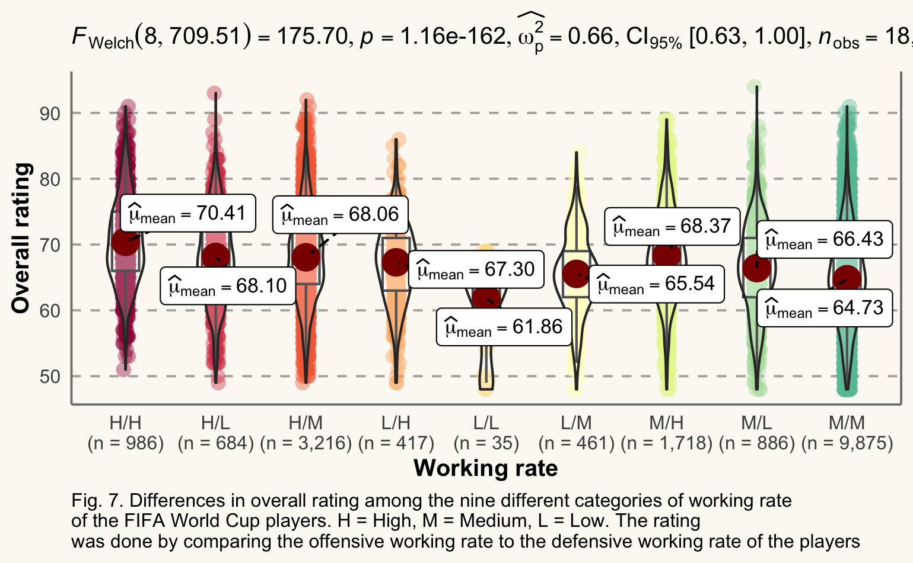
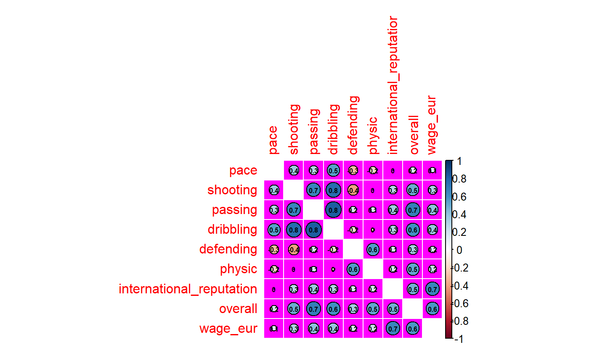
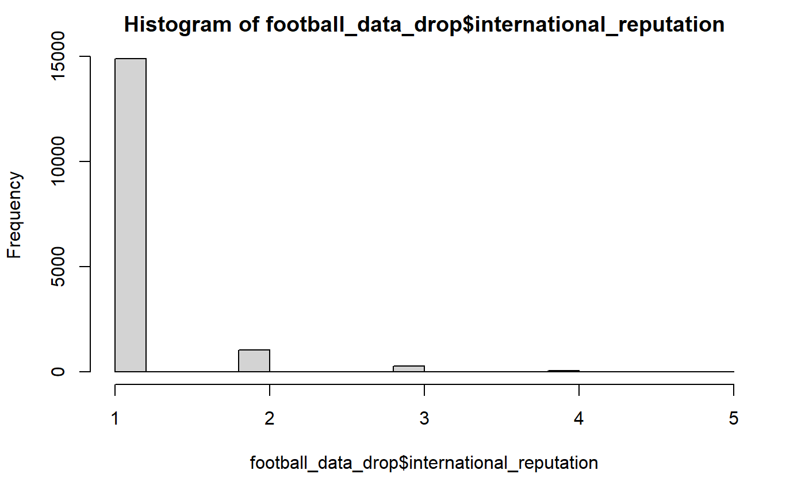
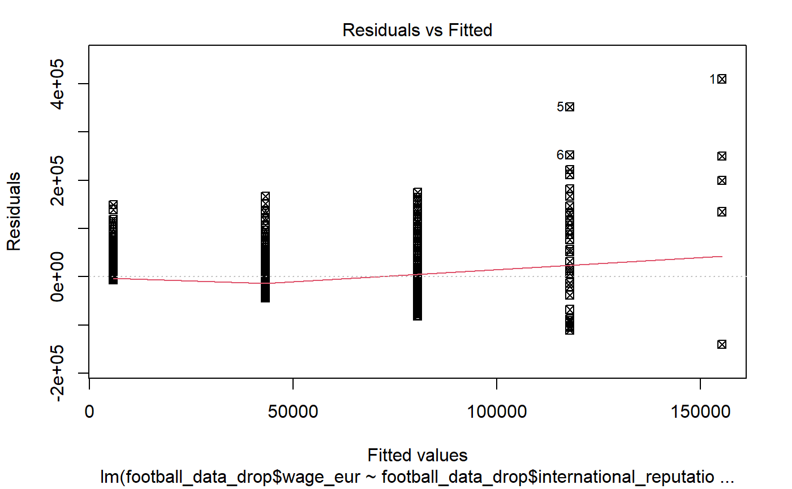
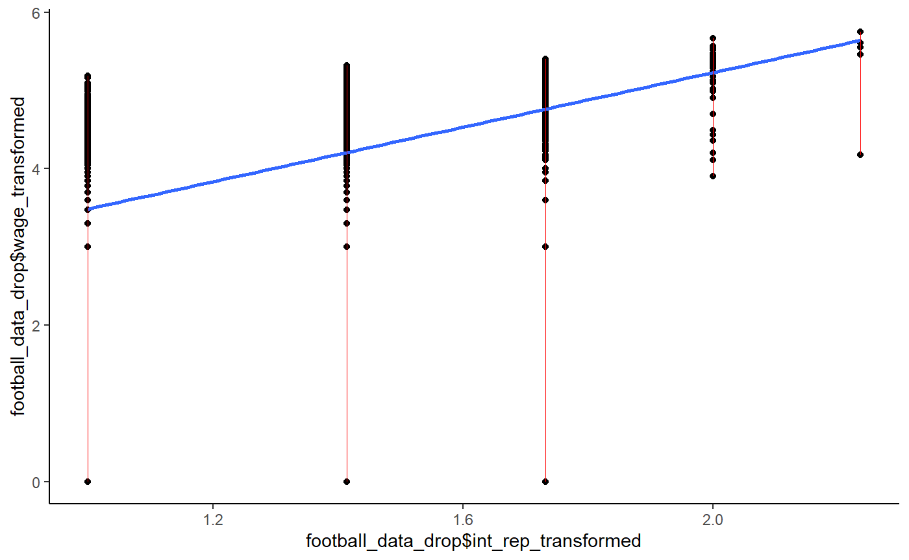
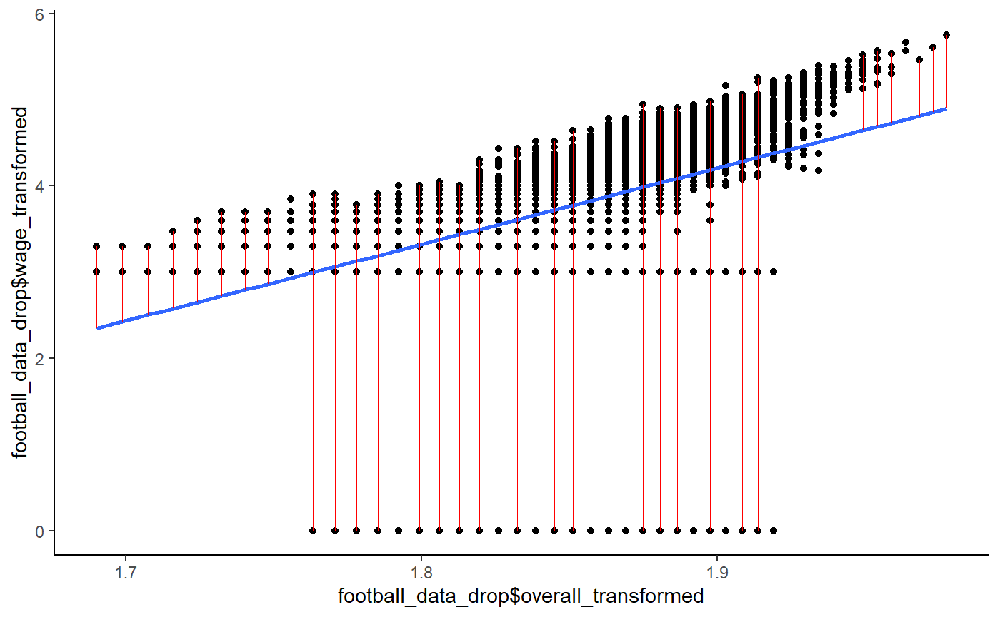

Stat 850 Project Description

John Mensah
Frank Kusi Agyemang
Christian Uwineza

# 1.0 INTRODUCTION
Football (also known as soccer) is one of the most popular and followed sports in the world. Football is a team sport that involves eleven players per team, with additional reserve players on the bench.  kicking a ball to score and defending is the main objective for the teams on the court. For each team, there is a goalkeeper whose purpose is to catch the ball (with his hand) or prevent the ball from entering the goalpost (by any means possible using any part of the body). The goalkeeper is the only player who is allowed to use the hand but only within the 18-yard box or the penalty box. Any foul committed against the attacking team in the penalty box is regarded as a Penalty. There are also the defenders that mainly play to prevent the ball from entering the goalpost. We also have midfielders that play a role as intermediaries that connect the ball between the defenders and the forwards. The forwards are known as the goal scores; due to their position on the field they usually stand a higher chance of scoring a goal. Depending on the role of the player, a midfielder may play as a defensive midfielder, central midfielder, attacking midfielder, and wide midfielder (also known as a winger)1. A team's ability to score a goal(s) in a match depends on the quality of attackers that they have (attackers here refers to both the forwards and attacking midfielders). Also, a team with a very strong defense stands a very low chance of conceding a goal(s). In both cases, a team with weak midfielders might face high attacking pressure from the opponent. 

There are many football competitions across the world, both at the club level and the national level. Among the numerous football competitions, the most popular and most anticipated of all is the FIFA World Cup. The FIFA World Cup, often simply called the World Cup, is an international association football competition contested by the senior men's national teams of the members of the Fédération Internationale de Football Association (FIFA, the International Federation of Association Football), the sport's global governing body2. Since its inaugural tournament in 1930 hosted and won by Uruguay, the FIFA World Cup Championship has been held every four years, except in 1942 and 1946 when it was not held due to the second world war2. So far, as of the 2018 FIFA World Cup in Brazil, twenty-one final tournaments have been held and a total of 79 national teams have participated2. The trophy has been won by eight national teams. Brazil has won five times, and they are the only team to have played in every tournament. The other World Cup winners are Germany and Italy, with four titles each; Argentina, France, and Uruguay, with two titles each; and England and Spain, with one title each.

The FIFA World Cup is the biggest stage of international football, and the players that take part in it are some of the best in the world. But how does FIFA rate the players that participate in this championship? For football lovers, the FIFA rating is one of the most anticipated sides of the game. Every football fan wants to know how his/her favorite football player was rated. This, sometimes, results in a lot of criticism and questions on how FIFA's overall ratings are composed. Most importantly what it is composed of, and how much do these compositions each contribute to the overall rating of the players? In general, there are over 35 different statistics that are composed of the FIFA overall rating of players3. However, six of them (i.e., speed, shooting, passing, dribbling, defending, and physicality) are notably known as they hold the greatest contributions3. The weighting given to these compositions is dependent on the player's team position (i.e., as a midfielder, defender, or forward). Also, the players' international reputation (IR; rated in stars, from one star to five stars) has been noted to add to the overall rating of the players (hereafter, OVR). There is another rating of players known as Weak Foot Skill (WFS) and Skill Moves (SM). Weak Foot Skill measures the ability of a player to shoot with one foot as he does with his preferred foot4. All players have a preferred foot (either the left foot or the right foot). Having a 5-star weak foot rating means that a player’s weaker foot shot is identical to their preferred foot shot. Having a 1-star weak foot rating means that the player can only shoot well with one foot4. Skill Moves measures the ability of a player to perform technical moves (also rated from one star to 5 stars). Another factor that is most likely to be overlooked is the players' workings rate. The player working rate considers the extent to which a player contributes to running and chasing in a match while not in possession of the ball5. This is categorized into attacking working rate (AWR) and defensive working rate (DWR). 
In this study, we sort to understand the OVR of FIFA World Cup players and its compositions. Specifically, we ask the following questions: 1. which of the six compositions (i.e., speed, shooting, passing, dribbling, defending, and physicality) contributes largely to the OVR of the players? 2. Does the preferred foot, international reputation, weak foot skill, skill moves, and working rate of the players matter when it comes to the player's performance?
The questions that are answered in questions one and 2 also lead us to pursue other interesting questions about the data such as Factors that contribute to the wage of a player who participated in the world cup competition. The variables that we will consider are pace/speed, shooting, passing, dribbling, defending, physic, international reputation, overall player rating, and wage in euros. Among these variables, the ones that are highly correlated would be used to develop several simple linear regression models and a multiple linear regression model. The response variable is the wage, and the explanatory variables are pace/speed, shooting, passing, dribbling, defending, physic, overall, international reputation.

^[ https://en.wikipedia.org/wiki/Midfielder]
^[ https://en.wikipedia.org/wiki/FIFA_World_Cup]
^[ https://earlygame.com/fifa/fifa-ratings-explained-overall-rating]
^[ https://fifauteam.com/fifa-20-weak-foot-upgrades/]
^[ https://en.wikipedia.org/wiki/Work_rate]

#  METHODS
##  Data Description 
The data for this study was downloaded from Kaggle using this link,
https://www.kaggle.com/datasets/thedevastator/fifa-world-cup-anomaly-detection-in-player-ratin?select=players_20.csv. The data is about FIFA World Cup players and their ratings. This data set contains detailed information related to the FIFA World Cup players, including information on players' overall ratings, as well as their individual ratings for specific skill sets. The data is made up of 18278 observations and 104 variables. Details on all variables can be found at the data download site. But for the purpose of this project, we will only focus on the following variables: 1. overall - The player's overall rating given on a percentage scale, 2. preferred foot - The player's preferred foot (either left foot or right foot), 3. international reputation - The player's international reputation rated on a scale of one to five, 4. weak foot - The player's weak foot rating on a scale of one to five, 5. skill moves - The player's skill moves rating on a scale of one to five, 6. working rate - this variable measures the working rate of the player on low, medium, and high scales. It is also measured based on attacking working rate vs defensive working rate, making a total of nine-factor levels (e.g., high/low = "high" attacking working rate and "low" defensive working rate), and 7. the six main compositions (i.e., speed, shooting, passing, dribbling, defending and physicality). Each of these compositions is an integer variable measured on a percentage scale. In total, out of the 104 variables, 12 variables are selected for our analysis. One (i.e., the overall) is the response variable, and the remaining 11 are the explanatory variables. For the explanatory variables, the players preferred foot and working rates are dummy/categorical variables. The players' international reputation, skill moves, and weak foot skills are rated in stars (i.e., from "1star" (lowest) to "5 stars" (highest)). In the data set, these star ratings were computed as integer variables but for the purpose of the analysis, we will treat them as factor variables with five levels (each level matching to a star; 1star, 2stars, 3stars, 4stars, and 5stars). The stars here can be seen as the unit of measuring these variables. The remaining six explanatory variables are the players' speed, shooting, passing, dribbling, defending, and physicality ratings; all rated on a percentage scale and computed as integers in the data set. 

##  Analysis
###  Which of the six compositions contributes largely to the OVR of the players?
We used random forest regression (Breiman et al. 2001) to model the relationships between overall ratings and the speed, shooting, passing, dribbling, defending, and physicality of the players. Random forest regression is a collection of tree-structured weak learners comprised of identically distributed random vectors where each tree contributes to a prediction for the response variable (here, overall rating) (Breiman et al. 2001). Random forest regression is modeled using a set of weak learners generated based on a bootstrap of the data that helps improve the algorithm's convergence to reach an optimal solution (Evans et al. 2011). This technique makes random forest regression insensitive to data distribution and robust to noise even given a very large number of independent variables with potential multicollinearity. It is also robust to overfitting, making it extremely useful for prediction (Prasad et al. 2006; Segal 2004). The main purpose of this analysis was to determine the variable importance for explaining the overall rating of the FIFA World Cup players based on the player's speed, shooting, passing, dribbling, defending, and physicality. This will be visualized based on the node of purity, which measures the overall contribution of the component factors. The higher the node of purity, the greater the contribution. In this study, the Random Forest model was built using the Random Forest package ver 4.7 available in R 4.1.2 (R Development Core Team 2022).

### Does the preferred foot, international reputation, weak foot skill, skill moves, and working rate of the players matter when it comes to player's performance? 
We will evaluate this using the ggbetweenstats function from the ggstatsplots (an extension of the ggplot2 package) package in R core team ver 4.1.2. The ggstatsplots package produces an elegant violin-box plot with statistical annotations to explore if there is any significant difference in the contribution of the players' preferred foot, international reputation, weak foot skill and skill moves on the overall FIFA ratings of the players. Here, we will make a separate violin-box plot for each of the following explanatory variables (all treated as categorical or factor variables): preferred foot, international reputation, weak foot skill, skill moves, and working rate. The OVR of the players is the response variable. 

###  What factors contribute to the wage of a player who participated in the world cup?
We made correlation plots to determine the level of association between pairs of explanatory variables and between explanatory variables and response variables. The correlation plots allow us to determine which variables we could select for the simple and multiple linear regression models. We were able to reduce the number of variables to few variables that has significant contribution to the wage of a player in the FIFA World Cup based on the correlation coefficients from the correlation plots. We proceeded to access whether the selected variables that were highly correlated with the response variables satisfied the normality assumption by calculating for skewness which was far greater than one and through Normal Q-Q plots. 
We transformed the data using the log to base 10 and square root functions to ensure that the data was approximately normally distributed. We regressed the response variable on each of the explanatory variables to assess how each of the explanatory variables contributed individually to the wage of a player. Residual plots for each model were also made for each model to determine whether the model satisfied all the model assumptions. The R package LinearModel, Tidyverse, and Broom were used to make these plots.
We then looked at how the explanatory variables together contributed to the wage of a player by making a multiple linear regression. We finally conducted an Analysis of Variance test on each of the models that were made.

### Teams paying their players more than others. 
We took a closer look at the players salary and grouped all players from the same team together then added all their salaries to come up with a sum of the totals teams are paying their players. We used the geom_col inside the gglot2 to make a nice graph with the top teams paying a lot to their players. 

# 3.0 RESULT and DISCUSION
## 3.1 The main compositions contribute disproportionately to the OVR of the players
Rating football players is one of the most anticipated exercises in the game of association football. The players, fans, investors, and any other person involved in the game look forward to the overall rating of the players. This is very important because it tells the overall performance of the player for the season under review, and influences the price, contract, and market demand of a player. Six main factors composite the overall rating of football players, but whether these factors differ in their overall contribution and how much they differ is not known. Also, how much variation in the overall rating is explained by these factors is quite not clear though it has been noted that the greatest proportion of the overall rating is dependent on six main factors: speed, shooting, passing, dribbling, defending and physicality of the players.

In order to evaluate the total variation and individual contribution of these six main factors to the overall rating of the FIFA World Cup players, we fitted a Random Forest model to the data. The random forest model revealed that, the six main factors considered in the overall rating of the players explains a total variation of 96.4% in the players' overall rating. This is much expected because the six factors considered are the main factors found on the FIFA Ultimate Team (FUT) card (Fig. 1).The FUT card contains information (including the player's name, photo, nation's flag, name, and club's badge) and statistics (the players rating on pace, shooting, dribbling, defense, passing, and physicality) of a real life footballer and is categorised based on the player's type and quality. These is statistics is commonly known to many as the only determinant of the players' OVR, but it is not always the case. In some cases, it has been noted that the players international reputation can influence the OVR by adding onto it^3.

Figure 2 measure the contribution of each of the six statistics on the FUT card on the players' OVR. We determined this based on the nodes of purity of a fitted regression trees. The concept of the node of purity in the regression tree is such that, the fitted model is a one big bushy forest (here a forest of 500 trees) and the various explanatory variables are factors that sustain the forest. Now, the forest is trimmed down by removing these explanatory variables that sustain the forest, and it done in a such a way that if one variable is removed how much of the forest would be reduced. The variable that will lead to the highest effect on the forest is classified as the one with the most increased node of purity (in other words, the most important variable). In fig 2, the dribbling skills of the players holds the highest node of purity, followed by defending skills and the passing skills, respectively. While the players pace was the least. The result in fig 2 reveal that the six statistics on the FUT card contribute differently in terms of their proportions to the OVR of the players and thus, the ability of a player to dribble or defend increases the chance of having a higher OVR. In other words, players with high dribbling or defending skills are more likely to have higher OVR compared to players with high paces or physicality.

![Fig. 1 A sample of the FIFA Ultimate Team (FUT) card of United State Men's National Team player, Christian Pulisic (a.k.a Captain America). The information on the FUT card shows that Pulisic has an OVR of 87 and plays a position as a left winger (LW). The FUT card also shows the six main statistics of the American footballer: PAC = the player's pace score, SHO = the player's Shooting power score, PAS = player's passing accuracy score, DRI = the player's dribbling skill rate, PHY = player's physicality, DEF = players defensive skill score](Pulisic.png)

### 3.2 The OVR of the FIFA World Cup players differs among different levels of international reputation, weak foot skills, skill moves, working rate, and the preferred foot. 

There has been a generational debate about left and right-footed footballers, which of them is most talented or plays very well. Generally, we do not observe as many left-footed footballers as right-footed footballers, but the few left-footed players are usually known to be very good. In fig 3, we compared the overall rating of the players' left and right preferred foot to see which of them has the highest OVR and if the difference is significant. In total, there were 4318 left-footed players and 13960 right-footed players. We found that the left-footed payers have significantly higher OVR (mean = 66.88) than the right-footed players (mean = 66.11) (Fig 3).

The international reputation of the players is rated based on how known/long they have played for their country. This is a very important rating as it helps boost the OVR of the players. In Fig 4, we found that a higher international reputation significantly increases the player's OVR. Playing on the national teams comes with a lot of sacrifices, and many players go to the extent to switch nationality to earn a call-up to play in international football competitions. Our result explains why many players are willing to make so many sacrifices with hard work to play for their countries. International reputation help improves not only the player's OVR but also the player's market demand and wages.

The ability of a football player to equally use the weak foot as the preferred foot is also a very important determinant of a player's rating. In Fig 5, we found that players that can use both their preferred and weak feet equally have higher ratings compared to those with less ability to use both feet equally. Being able to use both feet is an important skill to possess as a football player because it makes one unpredictable from the opponent and stands a very high chance of winning possession of the ball. Such players are also very versatile in the field and can play in positions that might require only left or right-footed players.

Skill moves are also very important in the game of association football. Players with low-skill moves are most likely to lose possession of the ball or have less dribbling efficiency. Fig 6 also showed that higher-skill moves significantly increase the player's OVR.

The work rate of the players is very important in a football game. It helps increase the chance of winning ball possession and decrease the possibility of conceding goals. The work rate of the players on a scale of high, medium, and low was assessed based on the attacking (offensive) vs defensive working rate. This help measures if the player has the same offensive working rate as the defensive working rate and vice versa. Knowledge of players' working rates is very key to deciding the formation or strategy of the team for a particular game. In fig 7, we compared the OVR of the FIFA players concerning their working rate. The purpose is to understand the disparity in offensive vs defensive working rate in the OVR of the players. We found that the OVR differs significantly among the nine different categories of working rate. On average, players with high offensive and the defensive working rate has the highest OVR (mean = 70.41), followed by players with medium offensive and high defensive working rate (mean = 68.37), high offensive and low defensive working rate (mean = 68.10), and high offensive and medium defensive working rate (mean = 68.06), respectively. While players with low offensive and defensive working rates have the least OVR (mean = 61.86). 

### 3.3 High paying football clubs around the world
Based on the player's value found in the data set, we took a closer look at the teams that are paying more to their players. The graph below shows the top 31 teams spending more money on their players. It was found that FC Barcelona, Real Madrid, Manchester City, FC Bayern Munchen and Liverpool are the top five teams that are paying a lot of money to their players. The top two teams are from Spain. We also have two teams from England and one team from Germany. 

With FC Barcelona being the top paying football club, we take a look deep into their players rating in the graph below. This team has at least 11 players with an overall rating greater than or equal to 85. 

### 3.4 Factors that contribute to the salary of a player in the world cup.
Football lovers often debate on what should be the right salary of a player. For most fans, some players do deserve the amount they are taking regardless of their performance on the field or contribution towards their team success. So far, there has been no clear criteria for determining the salary of a player and therefore the fair wage of players is subjective. If a football lover is impressed by the performance of a player, he is convinced that the e player receives a far wage and vice versa. 
In order to determine factors that contribute to the wage of FIFA World Cup players, we fitted Simple Linear and Multiple Linear Regression models to the data. The Simple Linear Regression models showed the individual contribution of each variable to the wage of a player in the FIFA World Cup whilst the Multiple Linear regression showed the net contribution of all the chosen variables to the wage of a player.

Plots and Plot2 shows the correlation between pairs of explanatory variables and the response variable. The level of association between variables were determined to be strong with some pairs of variables than others with use of the correlation coefficient.

The distribution of International Reputation which contributes significantly to the wage of a player in the World Cup was found to be skewed to the right. Skewness is a measure of the asymmetry of the probability distribution of a real-valued random variable about its mean.This could be positive, negative or zero. The skewness of this variable was determined to be about 4.25 which is far greater than zero.

The residual plots also shows that the data does not satisfy the normality assumption. It can be seen that there's unequal spread of data above and below the line.

The residual plot of the international reputation after the data was transformed with the log to base 10 function.

The normal q-q plot of the international reputation after the data was transformed showed that most of the point in the dataset was close to the line and therefore can be approximated by the normal distribution. We can see that only relatively few points are far away from the line.

>>>>>>> 784416b704299ae7ff9c35c0a6acc61a14919e92

# 4.0 CONCLUSION
I am waiting for the result from you guys so I can summarize everything here. 

### References
1. Breiman, L. (2001). Random forests. Machine learning, 45(1), 5-32.
2. Evans, J. S., Murphy, M. A., Holden, Z. A., & Cushman, S. A. (2011). Modeling species distribution and change using random forest. In Predictive species and habitat modeling in landscape ecology (pp. 139-159). Springer, New York, NY.
3. Prasad, A. M., Iverson, L. R., & Liaw, A. (2006). Newer classification and regression tree techniques: bagging and random forests for ecological prediction. Ecosystems, 9(2), 181-199.
4. Segal, M. R. (2004). Machine learning benchmarks and random forest regression.
5. R Core Team (2022). R: A language and environment for statistical computing. R Foundation for Statistical Computing, Vienna, Austria. URL https://www.R-project.org/.

## Group Members

John Mensah, Frank Agyemang, Christian Uwineza. 

